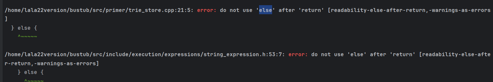

### task1

实现一个copy-on-write的字典树,大部分常用的方式是迭代法,但是在remove和put时会出现需要当前节点的parent更新它的children_的情况,比较麻烦, 所以应该采用递归的方式.并返回当前节点,以供上层的parent处理

(对于put,是更新parents的children;

对于remove,则是判断新的节点的`is_value_node_`是否为false,如果为false且节点的children_为空,说明这是一个不需要的叶子节点,可以删除(返回nullptr)).

#### tips:

* std::static_pointer_cast`是 C++ 标准库中的一个函数模板，用于进行智能指针之间的静态类型转换。它的功能类似于 C++ 的静态类型转换运算符`static_cast`，但是适用于智能指针的转换操作。
* `operator[]` 并不适用于常量对象，因为它可能会改变对象的内容。可以使用 `at()` 成员函数来代替 `operator[]`，因为 `at()` 支持常量对象的访问。
* 但需要将unique_ptr转化成shared_ptr(或者反过来等等智能指针的转换时),可以直接`return std::shared_ptr<const TrieNode>(std::move(copy_node));`c++会自动处理此类情况.

### task2

需要对之前的字典树实现封装,以达到支持多线程.

注意到put和remove时也需要给`std::mutex root_lock_;`上锁.

### task3

debug, 找到答案并填回头文件(推荐clion,不用折腾)

### task4

实现 upper lower 并注册函数.

此外, 为了通过格式检查,if return 后面不要加 else.

